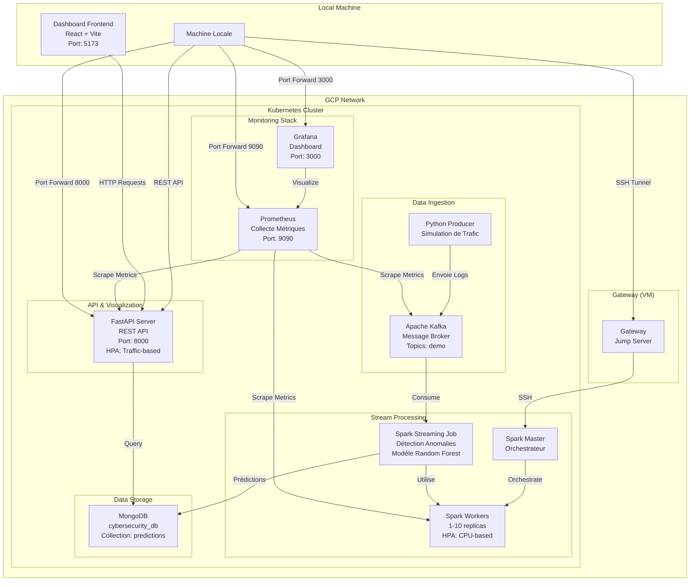
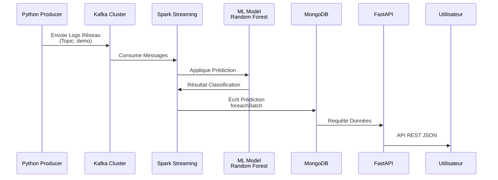

# Projet Système Distribué : Détection d’attaques de cybersécurité en temps réel

Ce projet implémente un pipeline de traitement de données en streaming pour détecter des menaces de cybersécurité à l'aide de Spark Streaming, Kafka, et un modèle de classification Random Forest.
## Architecture Système Distribuée en Cloud



## Flux de Données


##  Déploiement sur Google Cloud Platform (GCP)

Le déploiement s'effectue en trois phases : provisionnement de l'infrastructure, configuration logicielle, et lancement de l'application.

Note : Dans ce projet, l'adresse IP du Master est fixée à `10.240.0.10

### Partie 1 : Infrastructure & Configuration (Local)

1. Déploiement de l'infrastructure (Terraform) :
   Prépare les machines virtuelles (VM) sur GCP.
   ```bash
   cd terraform
   terraform init
   terraform plan
   terraform apply  # Tapez 'yes' pour confirmer
   ```
   *Note : Notez les IPs affichées à la fin (Gateway & Master).*

2. Configuration des machines (Ansible) :
   Installe Docker, Kubernetes (Kubeadm), Helm et les outils réseaux.
   ```bash
   cd ../ansible
   # Mettez à jour inventory.ini avec les IPs reçues
   ansible-playbook -i inventory.ini playbook.yml
   ```

3. Nettoyage des clés SSH :
   Pour éviter les erreurs d'identification après une réinstallation :
   ```bash
   ssh-keygen -f "$HOME/.ssh/known_hosts" -R "10.240.0.10"
   ```

### Partie 2 : Transfert et Connexion au Master

1. Transférer le projet vers le Master :
   ```bash
   rsync -avz -e 'ssh -i ansible/id_rsa_gcp -o ProxyCommand="ssh -W %h:%p -q ubuntu@<IP_GATEWAY> -i ansible/id_rsa_gcp"' \
   --exclude 'terraform' --exclude 'ansible' --exclude '.git' \
   . ubuntu@10.240.0.10:~/project
   ```

2. Se connecter au Master :
   ```bash
   ssh -i ansible/id_rsa_gcp -o ProxyCommand="ssh -W %h:%p -q ubuntu@<IP_GATEWAY> -i ansible/id_rsa_gcp" ubuntu@10.240.0.10
   cd project
   ```

### Partie 3 : Déploiement Applicatif (Ordre d'exécution)

Une fois sur le Master, exécutez les commandes make dans cet ordre précis :

1. Base de données :
   ```bash
   kubectl apply -f mongodb/mongodb-secret.yaml
   make start-mongodb
   ```
2. Infrastructure de Message :
   ```bash
   make start-kafka
   ```

3. Traitement Spark :
   ```bash
   make start-spark-pods
   ```

4. Auto-scaling (HPA) :
   ```bash
   make start-hpa
   ```

5. Injection des données :
   ```bash
   make start-python-producer
   ```

6. Lancement du Job de détection :
   ```bash
   make submit-spark-job
   ```

   *Note : Assurez-vous que spark_submit.sh est en encodage LF.*

7. Interface de consultation :
   ```bash
   make start-fastapi
   ```

8. Stack de Surveillance :
   ```bash
   make setup-monitoring
   ```

9. Dashboard Frontend (sur la machine locale) :
   ```bash
   cd dashboard_frontend
   npm install
   npm run dev
   ```
   Accès : http://localhost:5173

10. Stack de Surveillance :
    ```bash
    make setup-monitoring
    ```

---

## Accès aux Interfaces & Métriques

Depuis votre machine locale, utilisez les tunnels SSH suivants pour accéder aux interfaces privées du cluster.

### 1. Dashboard Frontend (Utilisateur Final)
Le dashboard React/Vite s'exécute sur votre machine locale et communique avec l'API FastAPI :
```bash
cd dashboard_frontend
npm install
npm run dev
```
Accès : http://localhost:5173

Le dashboard consomme l'API FastAPI déployée sur le cluster pour afficher :
- Les prédictions en temps réel
- Les statistiques de détection
- Les menaces identifiées

### 2. Monitoring (Grafana & Prometheus)
* Grafana (Visualisation) :
    ```bash
    ssh -i ./id_rsa_gcp -L 3000:localhost:3000 -o ProxyCommand="ssh -W %h:%p -q ubuntu@<IP_GATEWAY> -i ./id_rsa_gcp" ubuntu@10.240.0.10 "kubectl port-forward -n monitoring svc/kube-prometheus-stack-grafana 3000:80"
    ```
    Accès : http://localhost:3000 (admin / admin)

* Prometheus (Requêtes) :
    ```bash
    ssh -i ./id_rsa_gcp -L 9090:localhost:9090 -o ProxyCommand="ssh -W %h:%p -q ubuntu@<IP_GATEWAY> -i ./id_rsa_gcp" ubuntu@10.240.0.10 "kubectl port-forward -n monitoring svc/kube-prometheus-stack-prometheus 9090:9090"
    ```
    Accès : http://localhost:9090

### 2. API de Consultation (FastAPI)
```bash
ssh -i ./id_rsa_gcp -L 8000:localhost:8000 -o ProxyCommand="ssh -W %h:%p -q ubuntu@<IP_GATEWAY> -i ./id_rsa_gcp" ubuntu@10.240.0.10 "kubectl port-forward svc/fastapi-service 8000:8000"
```
Accès : http://localhost:8000/docs

### Dépannage des ports
Si un port est déjà occupé sur votre machine ou sur le master :
```bash
sudo lsof -i :3000  # ou 9090, 8000
pkill -f "kubectl port-forward"
```

---

## Détails des Composants

### Dashboard Frontend
- **Framework** : React 18 + Vite
- **Localisation** : Machine locale (http://localhost:5173)
- **Fonctionnalités** :
  - Visualisation en temps réel des prédictions
  - Affichage des statistiques de détection d'attaques
  - Interface utilisateur moderne avec Tailwind CSS
  - Communication avec FastAPI via REST API
- **Technologies** : React, Vite, Tailwind CSS, Axios/Fetch API
- **Build** : 
  ```bash
  npm run build  # Production build
  npm run preview  # Aperçu de la build
  ```

### Auto-scaling (HPA)
- Spark Workers : Scale automatiquement entre 1 et 10 réplicas selon la charge CPU.
- FastAPI : Scale selon le trafic de consultation.
- Surveillance : make status-hpa ou make watch-scaling.

### Producer Python
- Image : rabii10/python_producer:v4.2.2
- Simule des variations de trafic via MSG_RATE et BURST_POWER.
- Envoie les logs réseau au topic Kafka demo.

### Spark Streaming
- Image : rabii10/myspark:v5.3
- Consomme depuis Kafka, applique le modèle ML et écrit dans MongoDB.
- Utilise le mode foreachBatch pour la persistence.

### MongoDB
- Base : cybersecurity_db | Collection : predictions.
- Vérifier les stats : make query-stats.
- Vérifier les attaques : make query-attacks.

---

## Maintenance & Nettoyage

1. Vérifier l'état global : `make status`
2. Voir la consommation réelle : `make metrics`
3. Supprimer les ressources : `make delete-resources`
4. Reset complet (Purge) : `make nuke`